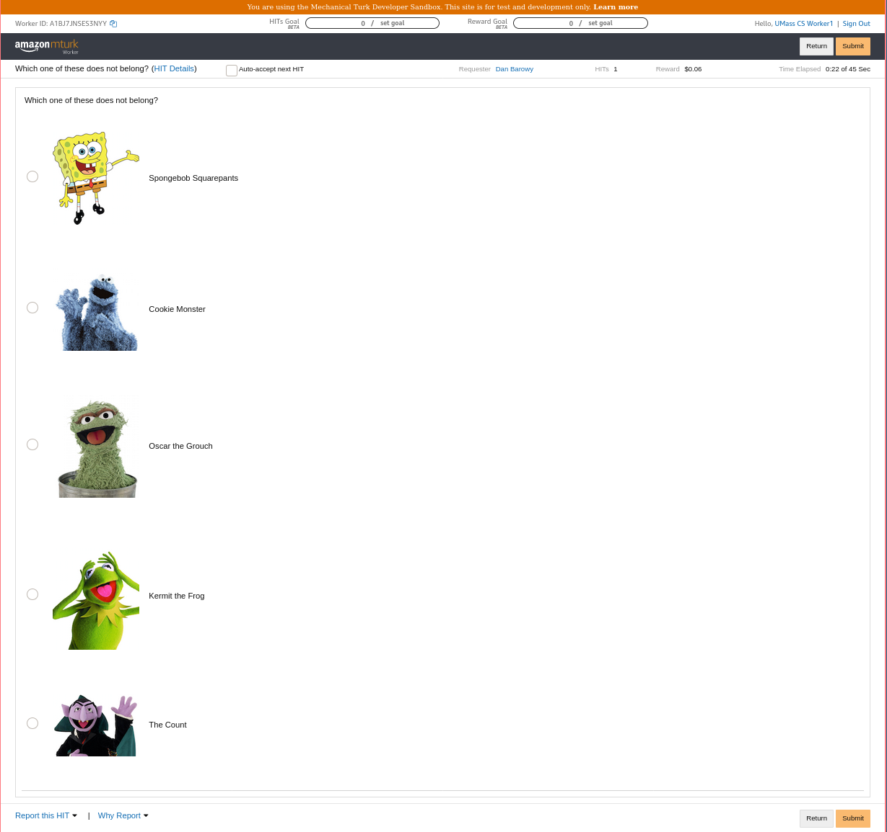

# AutoMan

## What is AutoMan? <a id="overview"></a>

AutoMan is the first fully automatic **crowdprogramming** system. With AutoMan, you declaratively define **human functions** and use them just as you would ordinary functions. Focus on your application logic instead of MTurk code.

AutoMan is currently available as a library for [Scala](https://www.scala-lang.org/).

## Example

```scala
  def which_one() = radio (
    budget = 5.00,
    text = "Which one of these does not belong?",
    options = (
      choice('oscar, "Oscar the Grouch", "https://tinyurl.com/y2nf2h76"),
      choice('kermit, "Kermit the Frog", "https://tinyurl.com/yxh2emmr"),
      choice('spongebob, "Spongebob Squarepants", "https://tinyurl.com/y3uv2oew"),
      choice('cookiemonster, "Cookie Monster", "https://tinyurl.com/y68x9zvx"),
      choice('thecount, "The Count", "https://tinyurl.com/y6na5a8a")
    )
  )

```

This function produces an MTurk task that looks like this:



The function can be called like any other function in Scala:

```scala
which_one()
```

Notice in the above declaration and function call, there was no need to specify task wages, the number of workers, how to handle network errors or other system failures, or how to determine whether answers are good.  AutoMan _automatically_ handles pricing, quality control, and task management.

## Learn More

To get started, see our [documentation](https://docs.automanlang.org).

## Acknowledgements

This material is based on work supported by National Science Foundation Grant Nos. CCF-1144520 and CCF-0953754 and DARPA Award N10AP2026. Microsoft Research also generously supported research and development by funding experiments on Mechanical Turk.
